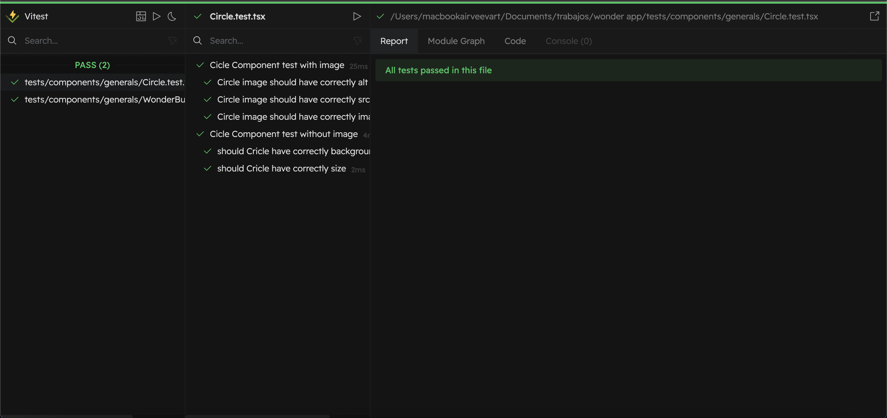
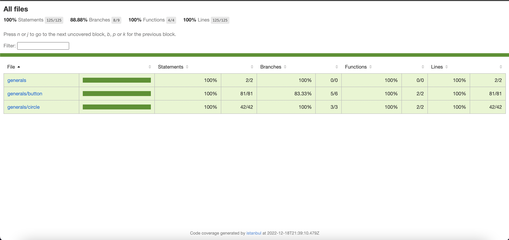
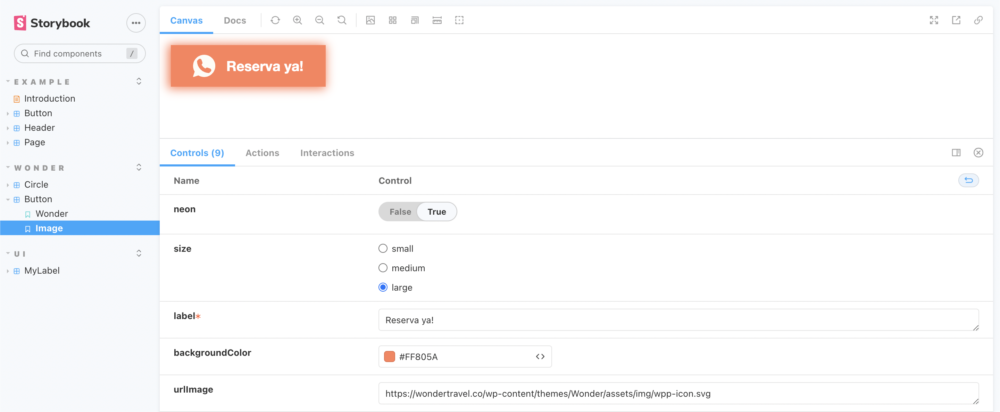

# Wonder App

Esta app esta hecha para dar información sobre planes de viajes.
El diseño esa pensando para mobile, sin embargo es responsive.

#### Link: https://wondertravelapp.netlify.app/

### Esta creada con:

-Module Bundler: VITE

-Superset javascript: Typescript

-Framework Javascript: ReactJs

-Preprocesador Css: PostCss

-Framework Css: TailwindCss

-Framework Testing: Vitest

-Libreria de testing: react-testing-library

-Package Manager: Yarn

### Como ejecutar la app
```
yarn install

yarn dev
```
### Como ejecutar los test
```
yarn test
```
Se desplegará una UI que le ayudará a visualizar los test



### Como ver el coverage del testing:
```
yarn coverage
```
-Go to: tests/coverage

-Open index.html



## Trabajo sobre componentes reutilizables

Para trabajar sobre componentes reutilizables se usaron story books, los cuales estan implementdos con:

-Module Bundler: CRA (create react app)

-Superset javascript: Typescript

-Framework Javascript: ReactJs

-Package Manager: Yarn

-Manejador de versiones: Chromatic y Github

#### Link : https://636fd55712827b1c13e9bde4-zdtaabqcsu.chromatic.com/?path=/story/wonder-button--image

Los componentes utilizados en este proyecto estan en la seccion WONDER, para personalizarlos usar la sección canvas y cambiar las propiedades de control, por ejemplo:

Para crear este botón: 


Ve a la sección wonder, componente Button y cambia las propiedades de control por:

- neon: true

- size: large

- label: Reserva ya!

- backgroundColor: #FF805A

- urlImage: https://wondertravel.co/wp-content/themes/Wonder/assets/img/wpp-icon.svg

- imageSize: small

- fontColor: #ffffff

- border: false



#### Repositorio storybook: https://github.com/danielmamian99/Storybooks-Components

## PWA

El stack de la aplicación sirve para implementarla como una PWA, se podría usar workbox como herramienta de configuración.